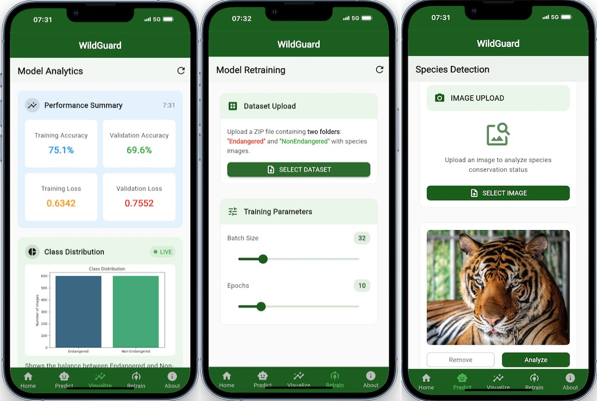

# WildGuard Animal Classification Model
---
## Overview
WildGuard is a deep learning model that classifies animal species as ENDANGERED or NON-ENDANGERED based on their images. This project aims to assist conservation efforts by automatically identifying endangered species from camera traps or user-submitted photos.

#### Bulk Dataset (1000+ Images)
Source: https://www.kaggle.com/code/muhammadfaizan65/90-animals-image-classification-efficientnetb3

---
##  Features

- **Real-time image classification**
- **Mobile-friendly interface (Flutter)**
- **Model retraining capability**
- **Data live visualization**
- **Model Image prediction**
  
---
## Project Structure
```
wildguard/
├── backend/                  # FastAPI backend (Deployed on Render)
│   ├── app/                 # API logic
│   │   ├── main.py          # FastAPI routes
│   │   ├── models.py        # Pydantic models
│   │   ├── schemas.py       # Data validation
│   │   ├── utils.py         # Helper functions (e.g., image preprocessing)
│   │   └── config.py        # API settings
│   ├── Dockerfile           # Containerization
│   ├── requirements.txt     # Python dependencies
│   └── model/               # Trained model weights (.pth or .h5)
│
├── frontend/                # Flutter app
│   ├── lib/
│   │   ├── screens/         # App screens
│   │   │   ├── home_screen.dart
│   │   │   ├── predict_screen.dart    # Camera/image upload
│   │   │   ├── retrain_screen.dart    # Model retraining UI
│   │   │   ├── visualize_screen.dart  # Stats/charts
│   │   │   └── about_screen.dart
│   │   ├── services/        # API client
│   │   ├── widgets/         # Reusable UI components
│   │   └── models/          # Data classes
│   ├── pubspec.yaml         # Flutter dependencies
│   └── assets/              # Fonts (Poppins), images
│
├── notebook/                # ML pipeline
│   └── Geu_Aguto_Animal__Classifcation_MLOP_Summative_Assignment.ipynb  # Data prep, training, evaluation
└── README.md
```
---
## Installation

### **Backend (FastAPI)**

**1. Navigate to the backend folder:**
```
cd wildguard/backend
```
**2. Install dependencies:**
```
pip install -r requirements.txt
```
**3. Run the API locally:**
```
uvicorn app.main:app --reload
```
### Frontend (Flutter)
---
1. Install Flutter SDK: flutter.dev/docs/get-started/install
2. Navigate to the frontend folder:
```
cd wildguard/frontend
```
3. Install dependencies:
```
flutter pub get
```
4. Run the app:
```
flutter run
```

## Prerequisites
- Python 3.9+
- TensorFlow 2.x
- OpenCV
- Flutter
- Numpy
- Pandas
- Matplotlib
- FastAPI (Backend)
- Render (Deployment)
---

## Installation
```bash
git clone https://github.com/your-username/Summative_assignment-MLOP.git
cd wildGuard-backend/backend

# Create a virtual environment
python -m venv venv
source venv/bin/activate  # Windows: venv\Scripts\activate

# Install dependencies
pip install -r requirements.txt
```

 ##  Backend Deployment (Hosted on Render)
 ---
**Live API Base URL:**
 ```
https://wildguard-api.onrender.com
```
**Interactive API Documentation**
Access Swagger UI directly:
 ```
 https://wildguard-api.onrender.com/api-docs
 ```
 ## Mobile App (APK) Installation
##### **Option 1: Download Pre-built APK**
1. Get the latest wildguard.apk from our releases:
```
https://github.com/Geu-Pro2023/Summative_assignment-MLOP/tree/main/frontend
```
2. On your Android device:
```
- Enable "Install Unknown Sources" (Settings → Security)
- Download the APK
- Tap to install
```
#### **Option 2: Build APK Locally**
```
flutter doctor #Flutter SDK is installed
```
```
cd wildguard/frontend
flutter build apk --release --target-platform android-arm64  # Generate a release APK:
```
```
frontend/build/app/outputs/flutter-apk/app-release.apk # Find the APK here
```
---
### 📥 Download APK (Latest Version)

[](app-release.apk.sha1)

**Installation Steps:**
1. Tap the download button above
2. On your Android device:
   - Go to `Settings → Security`
   - Enable **"Install unknown apps"** for your browser
3. Open the downloaded APK and tap "Install"

**Requirements:**
- Android 9 (Pie) or later
- 50MB free storage space
- Internet connection for predictions

**Checksum (SHA-256):**  
`a1b2c3...` *(replace with your actual checksum)*

#### Alternatively:

Get APK drive: https://drive.google.com/drive/folders/1SxE4q4SAHQTTMlLRVig3ySnqKaRW8eiy

## App Screens Interface

<p align="center">
  
</p>

---

## Usage (Instructions)
#### 1. Prediction
```
To predict whether an animal is endangered or not:

1. Open the WildGuard app on your mobile device
2. Upload or capture an image of an animal
3. Click the "Predict" button
4. The model will analyze the image and display the prediction as either:
   - ENDANGERED
   - NON-ENDANGERED
 ```
#### 2. Retraining the Model
```
Users can improve the model by retraining it with new data:

1. Navigate to the "Retrain" icon at the bottom of the WildGuard app
2. Prepare a zip file containing:
   - Two folders named "Endangered" and "Non-Endangered"
   - Each folder should contain images of the respective animal class
3. Upload the zip file through the app interface
4. Select training parameters:
   - Batch size
   - Number of epochs
5. Click "Retrain" to begin the retraining process
6. Once completed, the app will save the retrained model automatically
```
#### 3. Visualization
```
After retraining the model:

1. Navigate to the "Visualization" page in the app
2. View live training metrics and performance visualizations, including:
   - Accuracy graphs
   - Loss curves
   - Confusion matrices
3. The visualizations help understand the model's performance and improvement
```
---

## Video Presentation
Watch the walkthrough here: https://drive.google.com/file/d/17tE9LzR9vUP1QQYa_B7fYC0tINCzaq5G/view?usp=sharing

---
## Author
**Geu Aguto Garang**  
For an academic assignment involving ML deployment, mobile app integration, and model lifecycle management.

---
